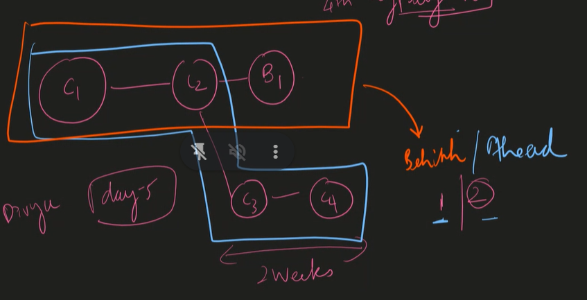
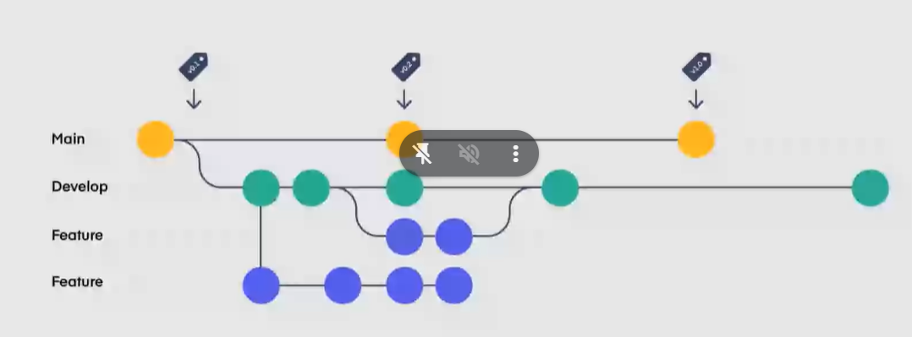
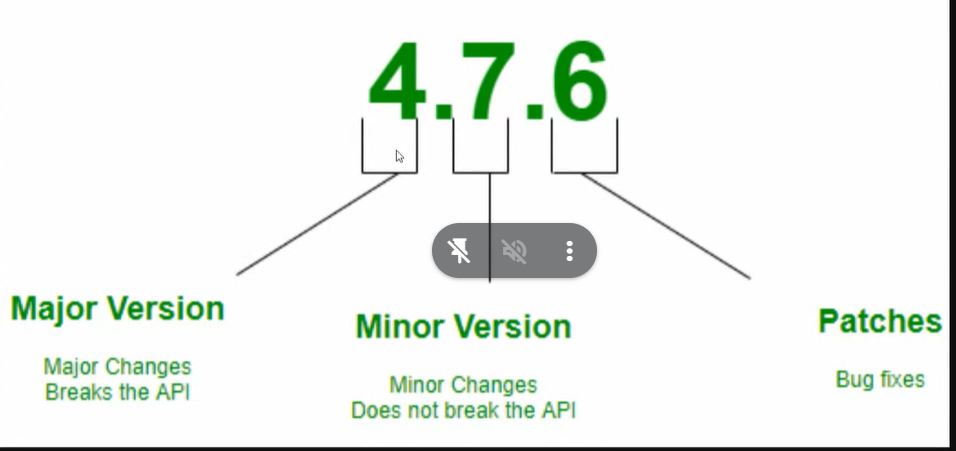
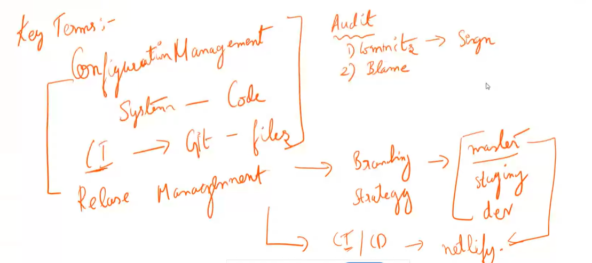
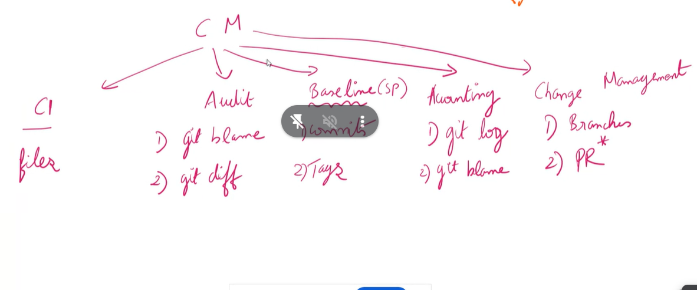
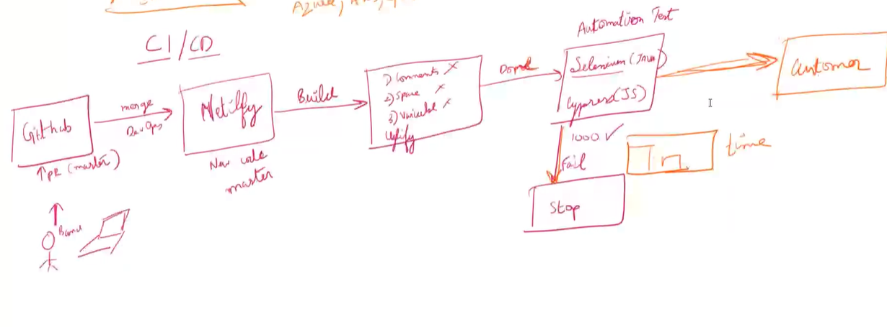

# What is Git

Git is like a super-smart record keeper for all the changes you make to the project's files. It tracks every edit, addition, or deletion you and your team make. So, if someone messes something up, Git can help you roll back to an earlier, working version.

To manage linux he invented the git.

This is called as distributred systems

### Why?

git is offline.

### How?

EVeryone has a copy, provides the backup.

## Git commands

git init ---> to initialize the repository
git add . ----> stage all the changes
git add ./hello.js ./fun.js-----> stage the particular mentioned files
git commit -m "Start of my git fundamentals"----> message to commit

# Git vs Git Hub

| Git                | Git Hub                                 |
| ------------------ | --------------------------------------- |
| Its an actual s/w  | Its a place to store files              |
| Its the VCS        | bitbucket, gitlab are similar to github |
| Its an offline s/w | It cannot work without internet         |

## Git Fundamentals

Pushing the code through command line

1. git init -> To initialize a repository
2. git add path -> To stage the changes
3. git status -> To check the file's current state
4. git commit -m "message" -> savepoint with a message
5. git log -> To Track the commits
   To exit from git log press 'q'
6. git checkout hashvalue - to jump to particular commit
7. git checkout - --> it brings back to the previous head pointing commit
8. git switch - -> Switch to the master branch
9. git checkout master -> To bring back to recent commit

### Git Log

1. git log -> to see commits
2. git log -n -> n number of recent commits will be shown  
   Filters

- --author==`<pattern>`
- -n `<n is number>`

3. git log -p -> patch (What code added or deleted), which lines modified in the files
4. git log -S -> pick-axe command
5. git log -S -p -> to track through the specific functions
   - `/<word>` - Highlight search
   - `<space>` - Page down
   - `n` - Next match
   - `N` - Prev match

### COMMIT

1. Why Commit is needed?
   - When there is logical change
2. Small Commits should made
3. Message should be proper

## VIM

Vim is an editor which will only open in git bash command line

- How to open vim?
  > vim filename
- Shortcut in vim
  > verb + number + movement
  > // VIM tutor & Vim games

## Three branches of GIT

### What are ahead and behind?

- Ahead: fast forward merge happens
- Behind: Merge commit will happen
  
  

## Semantic versioning:

it is also called sem ver

is a standard versioning scheme used in software development to convey meaning about the changes in a software package over time.



### Different verbs in VIM

1. Move up - k
2. Move down - j
3. Move left - h
4. Move right - l
5. Delete - d
   - Delete one word - d + 1 (Where you want to delete a word)
   - Delete multiple words - d + n (n words are deleted)
   - Delete a line - d + d
   - Delete a para - d + ip (inside para)
   - Delete a selected word - d + iw (inside word)
   - Delete characters till a particular char - d + char(ex:a,b,c)
6. Save - w
7. Exit - q
8. To repeat recent command - .

## Merging with the github

## Git conflicts

In Git, conflicts happen when two or more people change the same part of a file in different ways. Git can't automatically decide which changes to keep, so it asks you to help resolve the conflict by choosing which changes to keep and which to discard.

always pull the code first.

when someone wants to edit the same line that you are fixing, it allows to create the PR, but doesn't allow to merge.

## How to resolve the conflicts

```
<<<<<<< HEAD
This is my change from the local branch.
=======
This is my change from the remote branch.

> > > > > > > branch-name
```

## How to avoid the git conflicts?

- Pull Before Push

## Rebase

- log and rebase are in the reverse orders

**Rebasing** is like picking up your work from one point and moving it to another. Imagine you started working on a project a while ago, but since then, others have made changes. Rebasing lets you incorporate those changes into your work smoothly.

```javascript
git rebase -i hEAD~4
```

```
`-i`: This flag stands for "interactive". It tells Git that you want to perform an interactive rebase, which allows you to modify, reorder, squash, or drop commits during the rebase process.

`HEAD~4`: This specifies the commit range to rebase. HEAD~4 refers to the commit that is four commits before the current HEAD (i.e., the last commit). So, it selects the last 4 commits on your current branch.

When you run this command, Git will open an interactive rebase window or editor (e.g., Vim or Nano) where you can see a list of the selected commits. From there, you can choose what you want to do with each commit, such as reordering them, squashing them into one commit, editing their messages, or even dropping them entirely. Once you save and close the editor, Git will apply your chosen changes and complete the rebase.

- revert changes commit message.

```

Don't do rebase on the master, dev, staging branches . Only perform rebase on branches

Because it modifies the data which we dont want to happen.

## How do you merge in github or remote way?

devops people merge to master, we merge it to the dev branch

staging will be merged by testers

- Go to Repository: Open the repository in your web browser.

- Select Branch: Navigate to the branch you want to merge changes into.

- Create Pull Request: Click on the "New pull request" button.

- Compare Changes: Ensure the base branch is the one you want to merge into and compare changes with the branch containing the changes you want to merge.

- Review Changes: Check the changes to ensure they're correct.

- Merge Pull Request: If everything looks good, click the "Merge pull request" button.

- Confirm Merge: Confirm the merge in the dialog box that appears.

- Delete Branch (Optional): After merging, you may choose to delete the feature branch.

## Stashing

"stashing" in Git is a feature that allows you to temporarily store changes that are not ready to be committed, so you can work on something else without committing half-done work.

Here's how you can use stashing in Git:

Check Current Status: First, check the status of your working directory and staging area using git status to see which changes you want to stash.

Stash Changes: To stash your changes, use the command git stash. This will stash both staged and unstaged changes.

```javascript
git stash
```

Check Stash List: You can see your list of stashes using git stash list.

```javascript
git stash list
```

Apply Stash: To apply the most recent stash, you can use git stash apply.

```javascript
git stash apply
```

If you have multiple stashes, you can apply a specific stash by its index (e.g., stash@{2}).

```javascript
git stash apply stash@{2}
```

Pop Stash: To apply the most recent stash and remove it from the stash list, you can use git stash pop.

```javascript
git stash pop
```

Clear Stash: If you no longer need the stashed changes, you can clear the stash list using git stash clear.

```javascript
git stash clear
```

Stashing is useful when you're in the middle of working on a feature or fixing a bug, and you need to switch to another task or branch temporarily. It allows you to save your changes without committing them and retrieve them later when you're ready to continue working.

## Git rebase

To keep the history in the straight line

To do that we always need to the fast forward merge, but that may not be possible ,

So, we make all commits to linear. > Git bisect is the command

Imagine you and your friend are both writing code for a project. You're each working on different parts of the project in separate branches.

**Merging:** When it's time to combine your work, you could just merge your friend's branch into yours. This might work fine, but if there are any bugs in your friend's code, they could get mixed in with yours, making it harder to track down and fix them later. `so no merge`

**Rebasing:** Instead, you decide to rebase your branch onto your friend's. You carefully apply your changes on top of theirs, making sure everything still works as expected. This way, if there were any bugs in your friend's code, you have a chance to spot them and fix them before they get integrated with your changes. It's like taking your work and building on top of your friend's, ensuring that any issues are addressed before they become part of the main codebase.

Daily morning, come and run this command

```javascript
git pull --rebase origin dev
```

## Key terminologies

- Configuration Management{ related to branching strategy}
- System - code
- CI-> git - files(configuration item)
- Release Management--branching strategy---> master, staging dev.
- CI/CD - Continuous Integration/Continuous Deployment---> netlify
- Audit---> 1.commit-->sign
  2.Blame-->who last modified each line of a file



**Configuration management**

- CI with Git: Git helps teams continuously combine and test their code changes automatically.
- Audit in Git: Git keeps a detailed record of who did what in the project, helping track changes.
- Baseline in Git: Think of it as a project snapshot that shows how everything looked at a specific time.
- Accountability in Git: Git shows who's responsible for each change, encouraging ownership.
- Change Management with Git: Git helps teams manage updates smoothly, like organizing and tracking edits.
  

### Key benefits

> Traceability - Who? why?

> Quality and consistency

> Reduces the risk and errors

> Change management

## Release management

> planning --> 1. Branching strategy, Decide what you want to achieve with each release, what's most important, and what resources you need.

> Governance----> Talks about the access level of each branch,Make sure there are rules in place to guide how releases happen, who makes decisions, and that everything follows the rules and standards.

> Scheduling---> sprints, agile,Figure out when you're going to release things and how often, and make sure everything is coordinated properly.

> Automation---> CI/CD, testing is a part of cI/CD , no human, Use computers to do as much of the work as possible, like testing and deploying code.

> Contingency---> backup plans or roll back to older version.

## SAAS,PAAS, IAAS

Tools are netlify, CircleCI, render.com, jenkins

**Saas**: You **use software that's hosted online**, like Gmail or Netflix. You access it through your web browser or a mobile app without needing to install anything on your computer. Proclink is a saas

**Paas**: You get a platform for developing and deploying your own applications without worrying about the underlying infrastructure. It's like **renting a ready-made development environment** where you can focus on building your app, and the platform takes care of things like servers and databases for you. Heroku, netlify, render, vercale

**Iaas**: building your own home from scratch, In IT they give computers for renting
You **rent computing resources** like servers, storage, and networking from a cloud provider, such as Amazon Web Services (AWS) or Microsoft Azure. It's like renting a computer in the cloud instead of buying and maintaining physical servers.

Build step uglifies your code.

## How CI/CD makes release management easily?



In the image upto build it is CI and the rest is the CD

these pipelines are build with the jenkins
